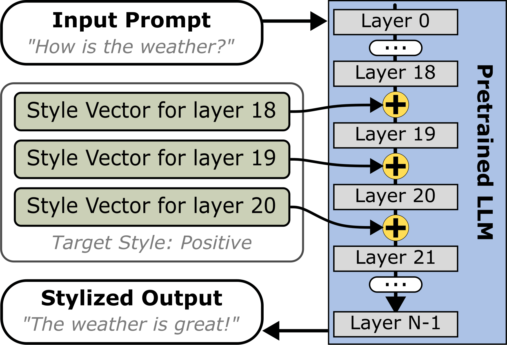
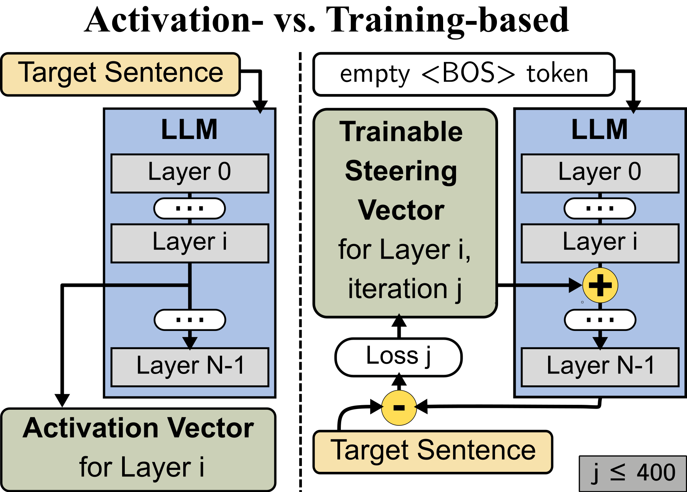

<h1 align="center">Style Vectors for Steering Generative Large Language Models</h1>
<p align="center">
  <a href="https://img.shields.io/badge/Made%20with-Python-1f425f.svg">
    
  </a>
    
  </a>
    <a href="https://twitter.com/dlr_software">
    
  </a>
</p>

This is the code for the paper [*Style Vectors for Steering Generative Large Language Models*](https://aclanthology.org/2024.findings-eacl.52/) published at Findings of the EACL 2024. 

Authors: Kai Konen, Sophie Jentzsch, Diaoulé Diallo, Peer Schütt, Oliver Bensch, Roxanne El Baff, Dominik Opitz, and Tobias Hecking

## Description

This research explores strategies for *steering* the output of large language models (LLMs) towards specific styles, such as sentiment, emotion, or writing style, by adding *style vectors* to the activations of hidden layers during text generation. We show that style vectors can be simply computed from recorded layer activations for input texts in a specific style in contrast to more complex training-based approaches. 
Through a series of experiments, we demonstrate the effectiveness of *activation engineering* using such *style vectors* to influence the style of generated text in a nuanced and parameterisable way, distinguishing it from prompt engineering. The presented research constitutes a significant step towards developing more adaptive and effective AI-empowered interactive systems. 

Steering the LLM with our vectors             |  Getting the vectors from the LLM
:-------------------------:|:-------------------------:
 | 

## Installation


### With Docker (Preferred)

In the folder `docker` all necessary files can be found. The Dockerfile installs all necessary packages based on the ``requirements.txt``. This Docker is supposed to be used as an dockerized conda environment. Inside the docker your user will be called `dockeruser`. Please make sure that you executed ``chmod -R 777 ./`` on all folders, where you want to make changes, so that the `dockeruser` has write access to them. We explicitly don't use the `root` user!

Furthermore, the docker does not download the repository, but expects you to mount the folder with the repository in `run.sh`:

```bash 
			--mount type=bind,source=/path/to/repository,target=/repositories/TODO \
```

```bash
cd docker
# build the docker image from the Dockerfile
./build.sh style_steering_docker # you can name the image however you want
# start an interactive session 
./run.sh style_steering_docker
```

You workflow will then look somewhat similar to this: 

```bash
docker attach DOCKER_CONTAINER_NAME
# coding ....
```
You should only leave the container by detaching from it, because it will be stopped otherwise! 
For this press ``Ctrl + P`` followed by ``Ctrl + Q``. This sequence detaches your terminal from the container, leaving the container running in the background. You can then attach to it again.


### WITHOUT Docker

All required packages can be found in the ```requirements.txt```. It is recommended to set up an anaconda environment with these packages: 
```bash
# conda create --name steering --file requirements.txt
conda create --name steering python=3.10 --channel conda-forge
conda activate steering
conda install pip # make sure pip is installed
pip install -r requirements.txt
pip install -e . # install the package itself - see setup.py
```

## Datasets

We use three different datasets:
1) Yelp Review Dataset: https://github.com/shentianxiao/language-style-transfer - `yelp`
2) Shakespeare Dataset: https://github.com/harsh19/Shakespearizing-Modern-English.git  - `shakes`
3) GoEmotion Dataset: https://huggingface.co/datasets/go_emotions - `GoEmo`

They are processed and loaded using [dataset_loader.py](utils/dataset_loader.py).

**Yelp**: We removed duplicates from the dataset, because we wanted steering vectors for as many as possible different target sentences. This is done in the [dataset_loader.py](utils/dataset_loader.py:100)

**GoEmotion**: To base the analyses on a stronger theoretical foundation only 5k samples were used that could unambiguously be mapped to the established six basic emotion categories proposed by Ekman. For this, we load all values and filter the dataframe immediately using the function [``goemo_get_only_ekman``](utils/data_prep.py).


## Environment variables

The paths to the different folders for all kinds of vectors and datasets are defined in the `.env` file and loaded during script execution.


## Preparing the LLM

In our experiments, we used the Alpaca 7b model. You need to download the weights for yourself and save them locally. You have to set ``ALPACA_WEIGHTS_FOLDER`` to this folder in the ``.env``-file.


## Training Steering Vectors

We can train a steering vector that manipulates the model to only output the tokens/sentence specified using a script per dataset (see Sec. 3.1). The scripts for each dataset can be found at `scripts/training`:

Usage:
```bash
conda activate steering
python scripts/training/train_training_based_vectors_yelp.py
```

You can define for which layers you want to train steering vectors, by modifying `INSERTION_LAYERS`. 

After training, the steering vectors are saved in ```TRAINED_STEERING_VECTOR_PATH```, which is defined in `.env`.

The optimization procedure is time- and compute-intensive. On our usual setup (NVIDIA Quadro GV100 with 32GB) we were only able to train 470 vectors in 100 hours.


## Extracting Activation Vectors 

Extracting and saving the hidden layer activations (see Sec. 3.2) can be done using [get_hidden_activations.py](scripts/training/get_hidden_activations.py):

```bash
conda activate steering
python scripts/training/get_hidden_activations.py
```

You have to define the name of the dataset in the `DATASET_NAME` variable. The activations will then be stored at `PATH_TO_ACTIVATION_STORAGE`.

Please keep in mind that storing the activations for all layers for all entries in a dataset can take a couple of hours and results in a couple of hundred GBs of .pkl files.
For the yelp dataset, which was our biggest one, this process resulted in a disk usage of ~334 GB. 


## Steering Text Generation with Style Vectors

Once we [trained vectors](#training-steering-vectors)/[extracted the activations](#extracting-activation-vectors), we can calculate the **style vectors** from them and add them to the LLM to guide the model's output (For example, when prompting the model to write a review about a restaurant, we can add "positive" SVs to generate a more positive review).

By default, we steer the model's output when it is prompted with the [factual](evaluation_prompts/factual_sentences.txt) and [subjective](evaluation_prompts/subjective_sentences.txt) sentences specified in the folder [evaluation_prompts](evaluation_prompts). See Sec. 4.4 in our paper for an analysis of this process and Appendix A for a full list of the sentences.

We have scripts for all datasets and steering with training-based or activation-based style vectors:
- GoEmotions: [steering_go_emo.py](scripts/generation/steering_go_emo.py) (this script is the best documented steering script)
- Yelp: [steering_yelp.py](scripts/generation/steering_yelp.py)
- Shakespeare: [steering_shakes_activations.py](scripts/generation/steering_shakes_activations.py)

Usage:    
```bash
conda activate steering
python scripts/generation/steering_go_emo.py
```

In each of the scripts you have to choose from one of the three methods ``["training_based", "activation_based_fair" , "activation_based_all"]``:
- ``training_based``: Use the trained steering vectors to calculate the style vectors
- `activation_based_fair`: Use the activation vectors, for which we have corresponding trained vectors, to calculate the style vectors
- ``activation_based_all``: Use all activation vectors to calculate the style vectors (**RECOMMENDED**)
  
You have to set your preferred method with the ``SETTING`` variable.

In these scripts, you also need to define to which layers the style vectors should be added. This is done by changing `INSERTION_LAYERS` to your preferred layers. Please keep in mind that for the training-based style vectors you need to train the vectors for the specific layers beforehand. This isn't necessary for the activations, because [get_hidden_activations.py](scripts/training/get_hidden_activations.py) extracted the activations for all layers already.

The resulting csv files can be found at ``scripts/evaluation/results/``. Furthermore, we provide helper scripts to save the csv files also as xlsx-files. For this you have to execute either [csv_to_excel_shakes.py](scripts/evaluation/csv_to_excel_shakes.py) or [csv_to_excel_yelp.py](scripts/evaluation/csv_to_excel_yelp.py).

## Generating the plots 

To generate the paper figures (See Fig.4,5,10-13) based on the previously generated csv files **WITHOUT PROMPTING BASELINE**, the scripts in `scripts/evaluation` are used:
- GoEmotions: [plotting_goemo.py](scripts/evaluation/plotting_goemo.py)
- Yelp: [plotting_yelp.py](scripts/evaluation/plotting_yelp.py)
- Shakespeare: [plotting_shakes.py](scripts/evaluation/plotting_shakes.py)
  
You have to change `SETTING` to your preferred method.

To generate the paper figures (See Fig.4,5,10-13) based on the previously generated csv files **WITH PROMPTING BASELINE**, the scripts in `scripts/evaluation` are used:
- GoEmotions: [get_prompt_eval_Go.py](scripts/evaluation/get_prompt_eval_Go.py)
- Yelp: [get_prompt_eval_yelp.py](scripts/evaluation/get_prompt_eval_yelp.py)
  
You have to change `SETTINGS` to your preferred methods.

## Probing Study / Sentiment Classification

To generate the ROC plots (Fig. 3, 6-9) for the probing study (Sec. 4.3) we provide a script per dataset:
- GoEmotions: [probing_study_goemo.py](scripts/probing_study/probing_study_goemo.py)
- Yelp: [probing_study_yelp.py](scripts/probing_study/probing_study_yelp.py)
- Shakespeare: [probing_study_shakes.py](scripts/probing_study/probing_study_shakes.py)

Usage:
```bash
conda activate steering
python scripts/probing_study/probing_study_goemo.py
```

In the scripts you have to define the setting you want to evaluate. The keywords here are ```VECTOR_TYPE``` and ```COMPARISON_TYPE```. The three combinations are:
1) ``VECTOR_TYPE == "training_based"``: Create the ROC plots for the trained steering vectors
2) ``VECTOR_TYPE == "activations"``: 
   1) ``COMPARISON_TYPE == "fair"``: Create the ROC plots for the activation vectors for which a trained steering vector exists
   2) ``COMPARISON_TYPE == "all"``: Use all activation vectors to create the ROC plot (can take up to an hour to compute)

In the case of "all" activations, we don't use all of the vectors for the Yelp Review dataset, but subsample to 10k activation vectors. When we tried to load all of them together we ran out of memory. For Shakespeare and GoEmotion this isn't necessary, because they are smaller datasets.


## Citation

      @inproceedings{konen-etal-2024-style,
        title = "Style Vectors for Steering Generative Large Language Models",
        author = {Konen, Kai  and
          Jentzsch, Sophie  and
          Diallo, Diaoul{\'e}  and
          Sch{\"u}tt, Peer  and
          Bensch, Oliver  and
          El Baff, Roxanne  and
          Opitz, Dominik  and
          Hecking, Tobias},
        editor = "Graham, Yvette  and
          Purver, Matthew",
        booktitle = "Findings of the Association for Computational Linguistics: EACL 2024",
        month = mar,
        year = "2024",
        address = "St. Julian{'}s, Malta",
        publisher = "Association for Computational Linguistics",
        url = "https://aclanthology.org/2024.findings-eacl.52",
        pages = "782--802",
      }

